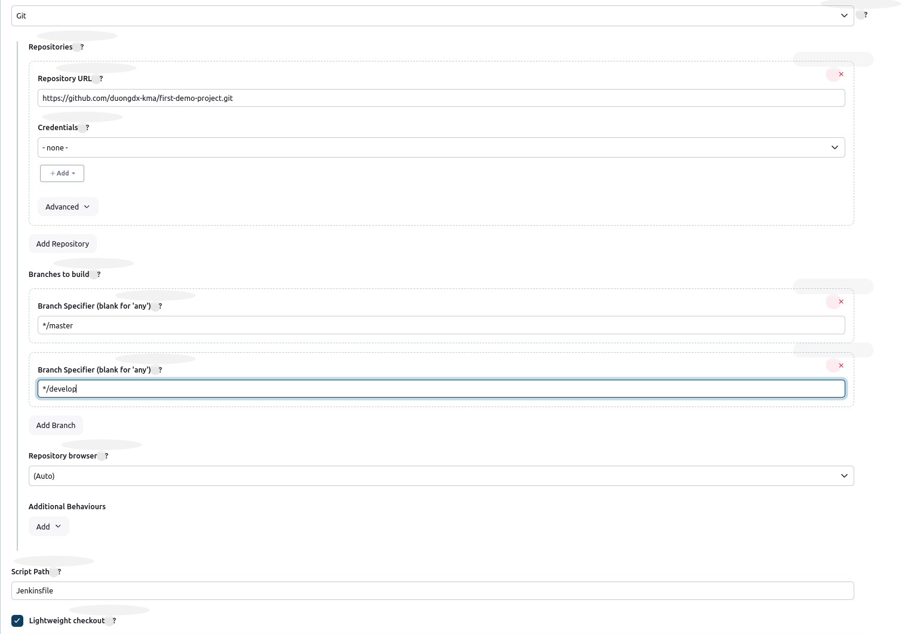

# Jenkins for `java spring boot`


## I. Necessary `Plugin`:

0. Modify Jenkins Resource if `jenkins running slow`
```powershell
sudo vim /var/lib/jenkins/jenkins.model.JenkinsLocationConfiguration.xml

sudo systemctl restart jenkins
```

1. GitHub: `GitHub Plugin`
2. Maven: `Maven Integration`, `Maven Invoker`
3. SSH: `Publish Over SSH`, `SSH`, `SSH Agent`

## II. Configure `Maven server` as Agent to Jenkins

### 1. inside the `Maven server`
```powershell
# check scripts/install-maven-as-jenkins-agent.sh
```

### 2. Config node on `Jenkins`

#### 2.1: Go to `Dashboard` > `Node` > `New Node`
```t
Name: maven
Description: Maven instance for building java project

Number of executors: 2
Remote root directory: /home/jenkins
Labels: maven-instance
Usage: Only build jobs
Launch method: SSH
    - Host: 10.100.5.88
    - Credential: using ssh private-key-pair
```

```powershell
sudo mkdir -p /var/lib/jenkins/.ssh
sudo touch /var/lib/jenkins/.ssh/known_hosts

sudo chown -R jenkins:jenkins /var/lib/jenkins/.ssh
sudo chmod 700 /var/lib/jenkins/.ssh
sudo chmod 600 /var/lib/jenkins/.ssh/known_hosts

sudo su

ssh-keyscan 10.100.5.88 >> /var/lib/jenkins/.ssh/known_hosts
```

#### 2.2 Create Project for Jenkins
1. Create new `Pipeline Project`: first-demo-project
2. Build Triggers: chonj

## III. Build with `Maven` Project with `Jenkins Pipeline`:

### General: Discard old builds
```t
- Days to Keep builds: 1
- Max number of build keep: 5
```

### Advanced Project Options: Poll SCM
```t
Schedule:

# every minute:
* * * * *

# every 5 minutes
*/5 * * * *
```

### Pipeline: ` Pipeline from Source Control Management (SCM)`
```t
- Repository URL: https://github.com/duongdx-kma/first-demo-project.git
- Credential: ...
- Branch:
    - main
    - develop
```


