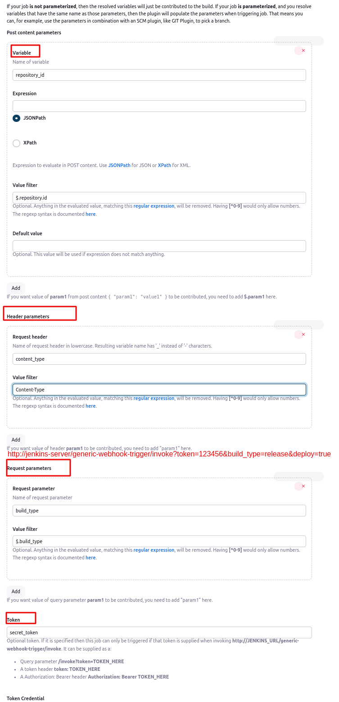

# Jenkins for `java spring boot` integration `Sonarqube bot`

## I. Pre-requisite - must meet all step on `jenkins.md`

## II. Config `Github` to trigger `Jenkins` whenever `have new pull request be created`:

#### step-01: add Jenkins plugin: `Generic Webhook Trigger`

#### step-02: config Jenkins Job:


## III. Explain the `Github delivery request` and  `Generic Webhook Trigger` params

### 01: For example `Github delivery request`:

**Headers:**
```
Request URL: https://jenkins.duongdx.com/github-webhook/
Request method: POST
Accept: */*
Content-Type: application/json
User-Agent: GitHub-Hookshot/3045686
X-GitHub-Delivery: 68af1f44-7db1-11ef-84b7-1b6e3f146dea
X-GitHub-Event: push
X-GitHub-Hook-ID: 503159377
X-GitHub-Hook-Installation-Target-ID: 860752342
X-GitHub-Hook-Installation-Target-Type: repository
```

**Payload:**
```json
{
  "ref": "refs/heads/cicd-jenkins",
  "before": "0000000000000000000000000000000000000000",
  "after": "282db090637239287039181b0ac49b579d5f3c3e",
  "repository": {
    "id": 860752342,
    "node_id": "R_kgDOM04J1g",
    "name": "spring-boot-todo-list",
    "full_name": "duongdx-kma/spring-boot-todo-list",
    "private": false,
    "owner": {
      "name": "duongdx-kma",
      "email": "147089206+duongdx-kma@users.noreply.github.com",
      "login": "duongdx-kma",
      "id": 147089206,
      "node_id": "U_kgDOCMRnNg",
      "avatar_url": "https://avatars.githubusercontent.com/u/147089206?v=4",
      "gravatar_id": "",
      "url": "https://api.github.com/users/duongdx-kma",
      // other parameters
      // ...
      "type": "User",
      "site_admin": false
    },
    "html_url": "https://github.com/duongdx-kma/spring-boot-todo-list",
    "description": null,
    "fork": false,
    "url": "https://github.com/duongdx-kma/spring-boot-todo-list",
    "forks_url": "https://api.github.com/repos/duongdx-kma/"
    // other parameters
    // ...
    "created_at": 1726893992,
    "updated_at": "2024-09-21T10:06:47Z",
    "pushed_at": 1727538638,
    "git_url": "git://github.com/duongdx-kma/spring-boot-todo-list.git",
    "ssh_url": "git@github.com:duongdx-kma/spring-boot-todo-list.git",
    "clone_url": "https://github.com/duongdx-kma/spring-boot-todo-list.git",
    "svn_url": "https://github.com/duongdx-kma/spring-boot-todo-list",
    "homepage": null,
    "size": 101,
    "stargazers_count": 0,
    "watchers_count": 0,
    "language": "Java",
    "has_issues": true,
    "has_projects": true,
    "has_downloads": true,
    "has_wiki": true,
    "has_pages": false,
    "has_discussions": false,
    "forks_count": 0,
    "mirror_url": null,
    "archived": false,
    "disabled": false,
    "open_issues_count": 0,
    "license": null,
    "allow_forking": true,
    "is_template": false,
    "web_commit_signoff_required": false,
    "topics": [

    ],
    "visibility": "public",
    "forks": 0,
    "open_issues": 0,
    "watchers": 0,
    "default_branch": "main",
    "stargazers": 0,
    "master_branch": "main"
  },
  "pusher": {
    "name": "duongdx-kma",
    "email": "147089206+duongdx-kma@users.noreply.github.com"
  },
  "sender": {
    "login": "duongdx-kma",
    "id": 147089206,
    "node_id": "U_kgDOCMRnNg",
    "avatar_url": "https://avatars.githubusercontent.com/u/147089206?v=4",
    "gravatar_id": "",
    "url": "https://api.github.com/users/duongdx-kma",
    "html_url": "https://github.com/duongdx-kma",
    // other parameters
    // ...
    "type": "User",
    "site_admin": false
  },
  "created": true,
  "deleted": false,
  "forced": false,
  "base_ref": "refs/heads/ci-jenkins",
  "compare": "https://github.com/duongdx-kma/spring-boot-todo-list/compare/cicd-jenkins",
  "commits": [

  ],
  "head_commit": {
    "id": "282db090637239287039181b0ac49b579d5f3c3e",
    "tree_id": "285117cea94bdf1a721f9b85b64acb7ee697afe7",
    "distinct": true,
    "message": "Jenkinsfile - maven publish to nexus with SNAPSHOT",
    "timestamp": "2024-09-24T02:13:29+07:00",
    "url": "https://github.com/duongdx-kma/spring-boot-todo-list/commit/282db090637239287039181b0ac49b579d5f3c3e",
    "author": {
      "name": "duongdx-kma",
      "email": "duong.dinh.xuan998@gmail.com",
      "username": "duongdx-kma"
    },
    "committer": {
      "name": "duongdx-kma",
      "email": "duong.dinh.xuan998@gmail.com",
      "username": "duongdx-kma"
    },
    "added": [

    ],
    "removed": [

    ],
    "modified": [
      "pom.xml"
    ]
  }
}
```

### 02: Explanation for `Generic Webhook Trigger`

#### Jenkins Parameter: `Post content parameters`

**1. concept:**
```
Post content parameters allow you to extract data from the body of the webhook payload (typically in JSON format)
```

**2. example:**
```powershell
genericVariables: [
    # Get Payloads: "ref": "refs/heads/cicd-jenkins"
    [key: 'ref', expressionType: 'JSONPath', value: '$.ref'],

    # Get Payloads: repository.id
    [key: 'repository_id', expressionType: 'JSONPath', value: '$.repository.id'],

    # Get Payloads: repository.name
    [key: 'repository_name', expressionType: 'JSONPath', value: '$.repository.name']
]
```

#### Jenkins Parameter: `Header parameters`
**1. concept:**
```
Header parameters allow you to extract values from the HTTP headers of the webhook request. HTTP headers typically contain metadata about the request, such as authentication tokens, content types, or GitHub event types.
```

**2. example:**
```powershell
genericHeaderVariables: [
    # Get Headers: `Content-Type = application/json`
    [key: 'content_type', expressionType: 'header', value: 'Content-Type'],

    # Get Headers: `X-GitHub-Event = push`
    [key: 'github_event', expressionType: 'header', value: 'X-GitHub-Event'],
]
```

#### Jenkins Parameter: `Request parameters`

**1. concept**
```
Request parameters extract values from the URL query string in the webhook request. Query strings are appended to the URL as part of the request, often to send small pieces of data or flags.
```

**2. example:**
```powershell
# example Jenkins webhook: http://jenkins-server/generic-webhook-trigger/invoke?token=123456&build_type=release&deploy=true

genericVariables: [
    # get token=123456
    [key: 'token', expressionType: 'JSONPath', regexpFilter: '', value: '$.token'],

    # get build_type=release
    [key: 'build_type', expressionType: 'JSONPath', regexpFilter: '', value: '$.build_type'],

    # get deploy=true
    [key: 'deploy', expressionType: 'JSONPath', regexpFilter: '', value: '$.deploy']
],
```

#### Jenkins Parameter: `Token`
```
Optional token. If it is specified then this job can only be triggered if that token is supplied when invoking http://JENKINS_URL/generic-webhook-trigger/invoke.
It can be supplied as a:
- Query parameter /invoke?token=TOKEN_HERE
- A token header token: TOKEN_HERE
- A Authorization: Bearer header Authorization: Bearer TOKEN_HERE
```