# Jenkins for `java spring boot`

## I. Necessary `Plugin`:

0. Modify Jenkins Resource if `jenkins running slow`
```powershell
sudo vim /var/lib/jenkins/jenkins.model.JenkinsLocationConfiguration.xml

sudo systemctl restart jenkins
```

### 1. GitHub: `GitHub Plugin`
### 2. Maven: `Maven Integration`, `Maven Invoker`
### 3. SSH: `Publish Over SSH`, `SSH`, `SSH Agent`

## II. Configure `Maven server` as Agent to Jenkins

### 1. inside the `Maven server`
```powershell
# check scripts/install-maven-as-jenkins-agent.sh
```

### 2. Config Nodes on `Jenkins`

#### 2.1: Go to `Dashboard` > `Node` > `Built-In Node`:Add label for build-in node
```t
label-name: built-in
```

#### 2.2: Go to `Dashboard` > `Node` > `New Node`
```t
Name: maven
Description: Maven instance for building java project

Number of executors: 2
Remote root directory: /home/jenkins
Labels: maven-instance
Usage: Only build jobs
Launch method: SSH
    - Host: 10.100.5.88
    - Credential: using ssh private-key-pair
```

```powershell
sudo mkdir -p /var/lib/jenkins/.ssh
sudo touch /var/lib/jenkins/.ssh/known_hosts

sudo chown -R jenkins:jenkins /var/lib/jenkins/.ssh
sudo chmod 700 /var/lib/jenkins/.ssh
sudo chmod 600 /var/lib/jenkins/.ssh/known_hosts

sudo su

ssh-keyscan 10.100.5.88 >> /var/lib/jenkins/.ssh/known_hosts
```

#### 2.3 Create Project for Jenkins

**Create new `Pipeline Project`: first-demo-project**

## III. Build with `Maven` Project with `Jenkins Pipeline`:

### 1. General: Discard old builds
```t
- Days to Keep builds: 1
- Max number of build keep: 5
```

### 2. Advanced Project Options: Poll SCM
```t
Schedule:

# every minute:
* * * * *

# every 5 minutes
*/5 * * * *
```

### 3. Pipeline: ` Pipeline from Source Control Management (SCM)`
```t
- Repository URL: https://github.com/duongdx-kma/first-demo-project.git
- Credential: ...
- Branch:
    - main
    - develop
```

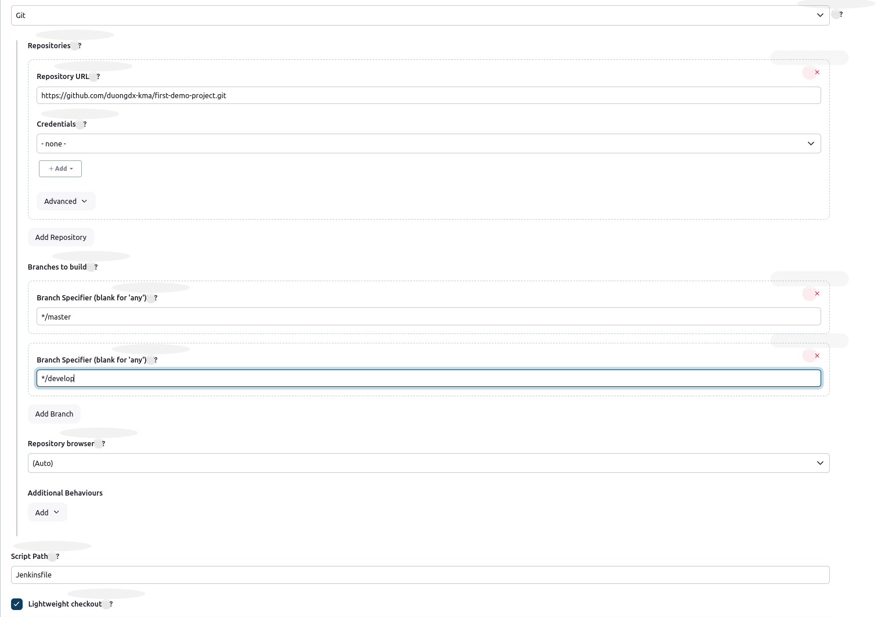

### 4. Create `tomcat-ssh-key` credentials for pipeline

#### 4.1. Go to `Manage Jenkins` > `Credentials` >  `System`
#### 4.2. Create SSH credentials with key with ID `tomcat-ssh-key` and `username: ec2-user`
#### 4.3. edit pipepline with `ssh private key name: tomcat-ssh-key`

## IV. Jenkins Pipeline for `duongdx-kma/spring-boot-todo-list`

### 0. Install Jenkins Plugins:

#### 0.1. GitHub: `GitHub Plugin`
#### 0.2. Maven: `Maven Integration`, `Maven Invoker`, `Pipeline Maven Integration`, `Pipeline Utility Steps`
#### 0.3. SSH: `Publish Over SSH`, `SSH`, `SSH Agent`
#### 0.4. Nexus: `Nexus Artifact Uploader`

### 1. Config `Jenkins Tools`: `Manage Jenkins` > `Tools`
```
- ADD Open JDK 17
- Name: OpenJDK17
- JAVA_HOME: /usr/lib/jvm/java-17-openjdk-amd64
```

```
- ADD Open JDK 11
- Name: OpenJDK11
- JAVA_HOME: /usr/lib/jvm/java-11-openjdk-amd64
```
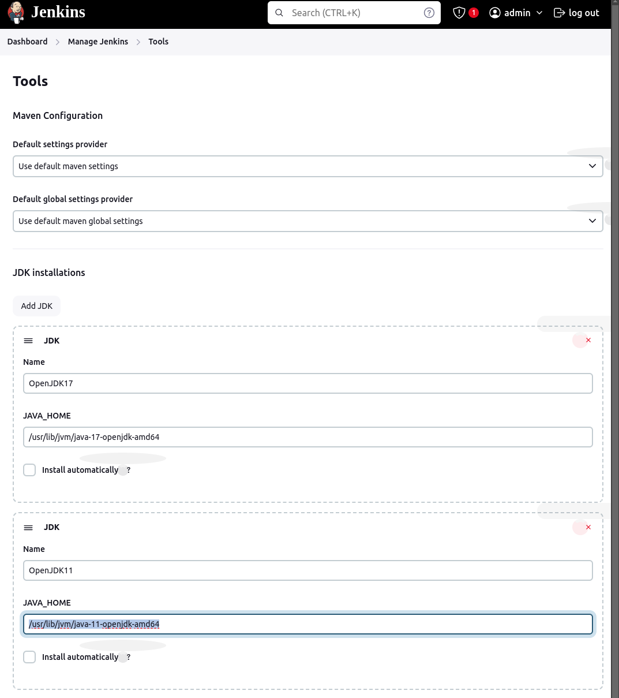


### 2. config maven
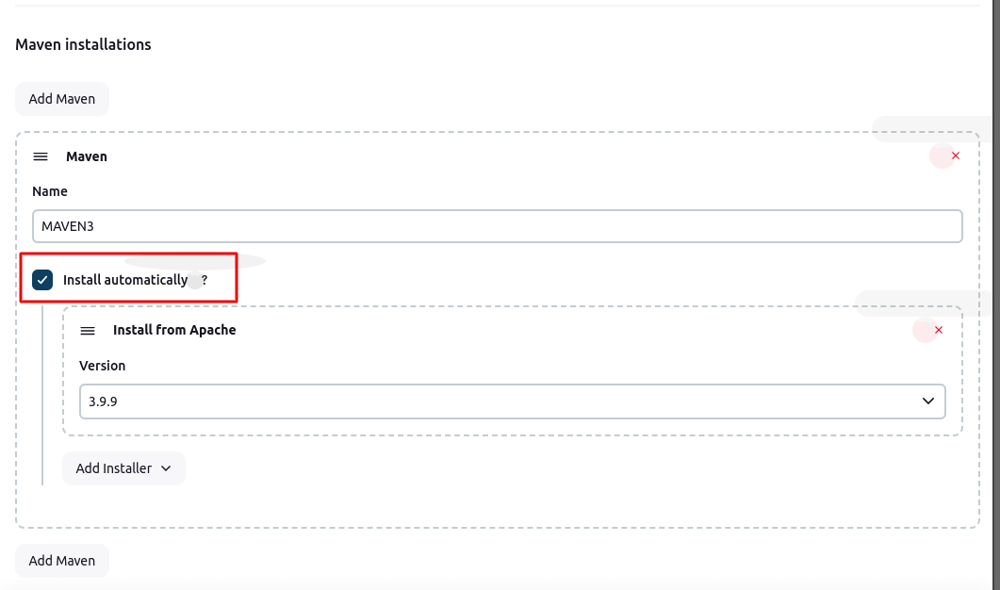

### 3. config `nexus user credential`
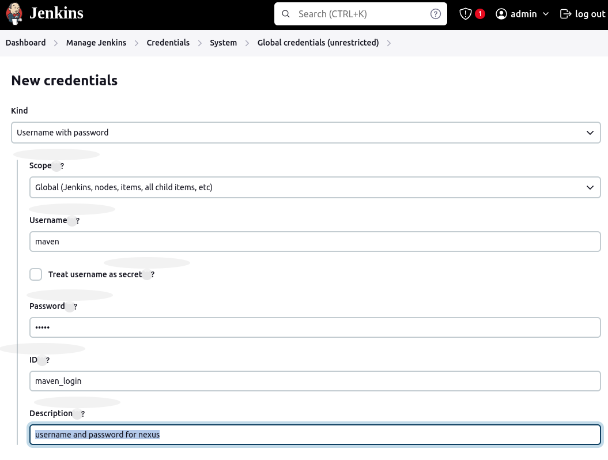

### 4. config `duongdx-kma/spring-boot-todo-list/settings.xml`

### 5. config `duongdx-kma/spring-boot-todo-list/pom.xml`

### 6. config `SonarQube Server`:

#### 6.1 create `sonarqube token`
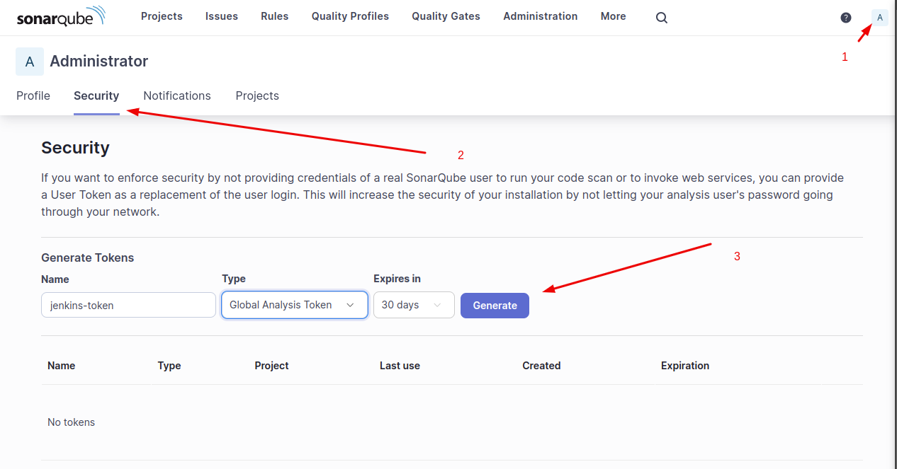

#### 6.2 add Jenkins `sonarqube credential`
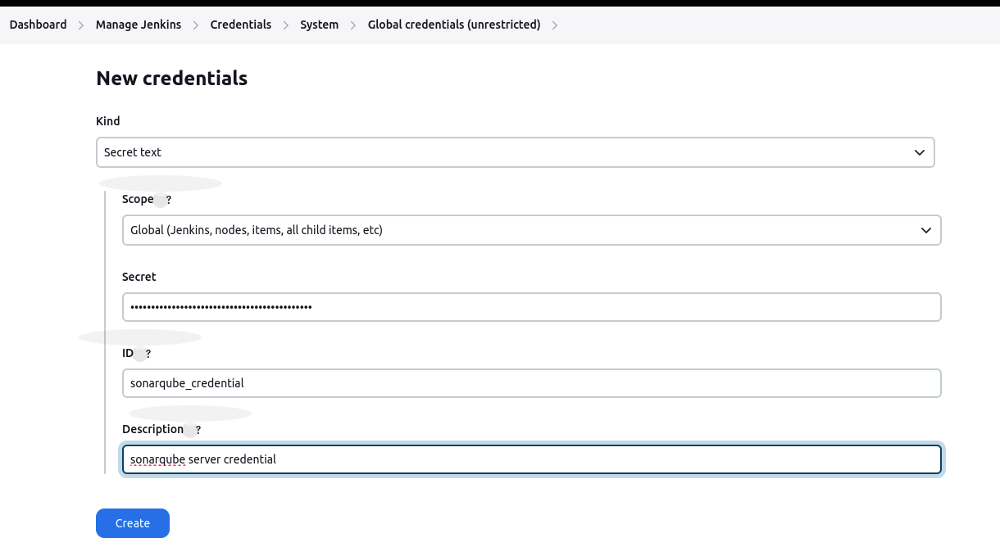

#### 6.3 config Jenkins `SonarQube Server`:  `Manage Jenkins` > `Systems` > `SonarQube Server`

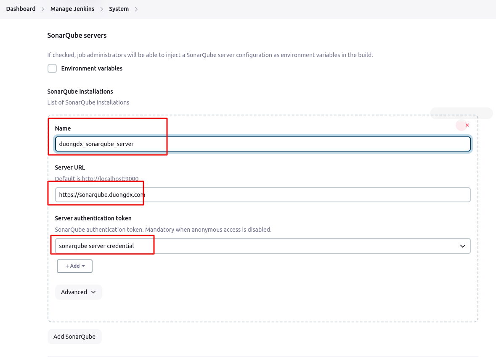

### 7. config `SonarScanner`:

#### 7.1. add Jenkins Plugins: `Manage Jenkins` > `Plugins` > `Available Plugins`:
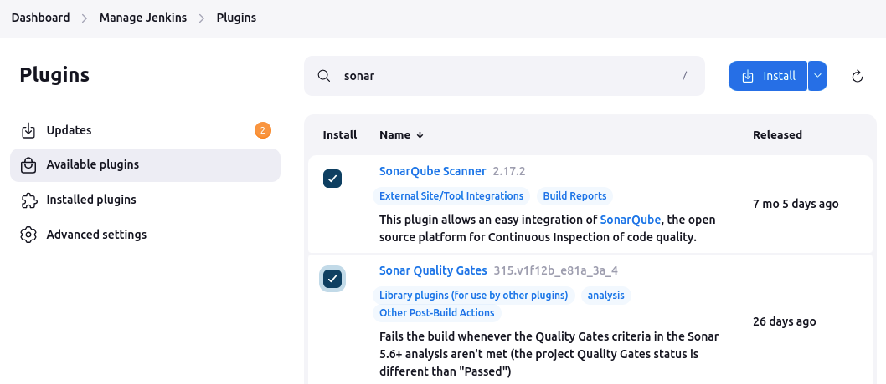

#### 7.2. add Jenkins `SonarQube Scanner`: `Manage Jenkins` > `Tools` > `SonarQube Scanner installations`:

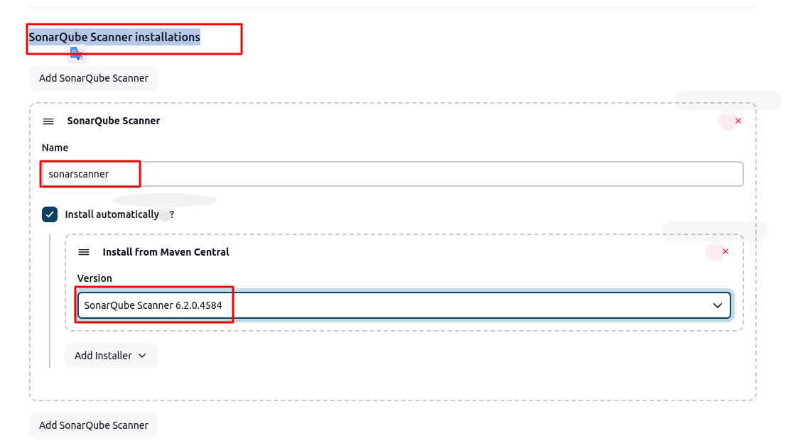


### 8. Create Jenkins `pipeline` and `github webhook`

#### 8.1 create Jenkins pipeline
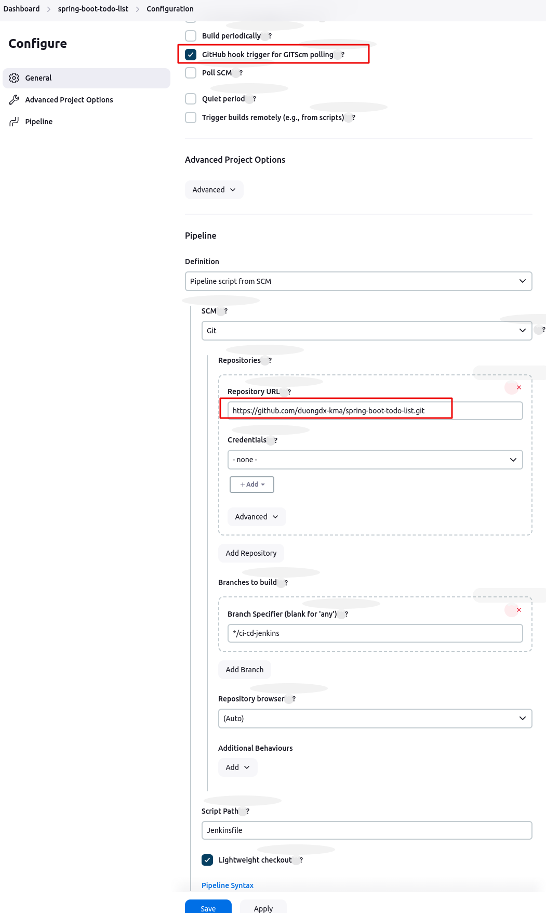

#### 8.2 create `github webhook`:
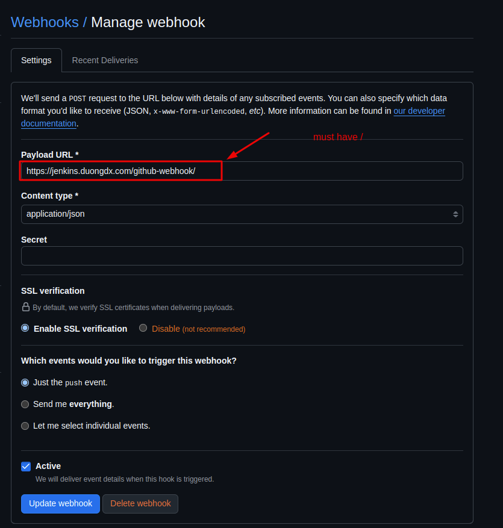

### 8. config Sonarqube Quality Gate:

#### 8.1 create `Sonarqube Quality Gate`
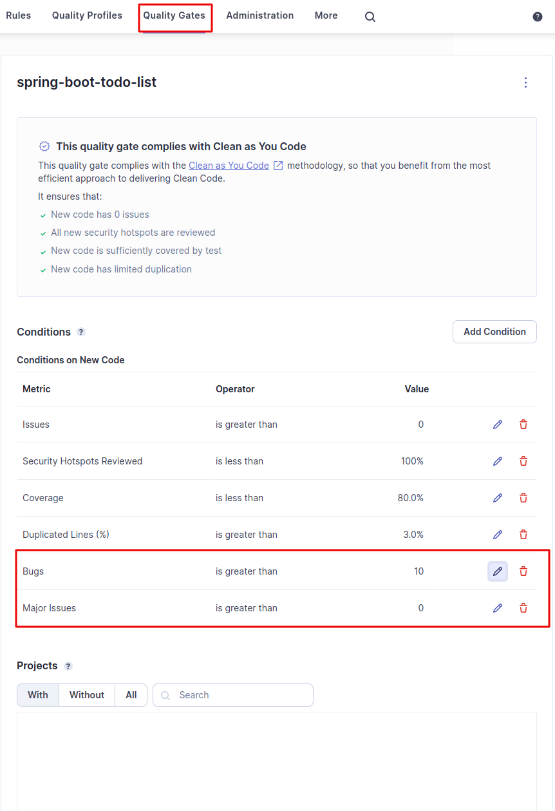

#### 8.2 add `Quality Gate` to Project

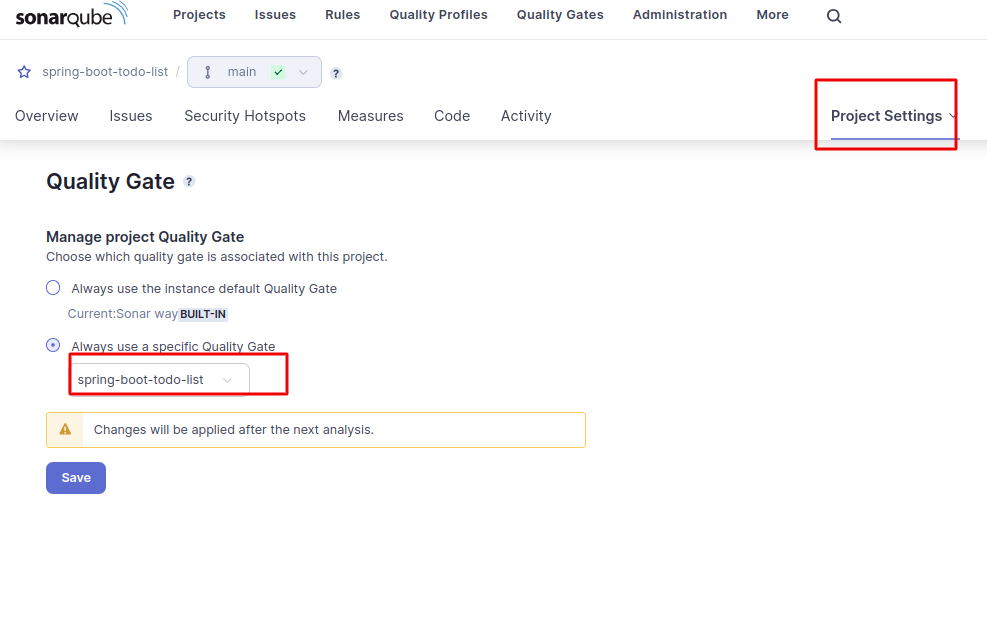

#### 8.3 create `Jenkins Sonarqube webhook` on `Sonarqube project`: it will be sent data when `Quality Gate: Fail, Success ...`
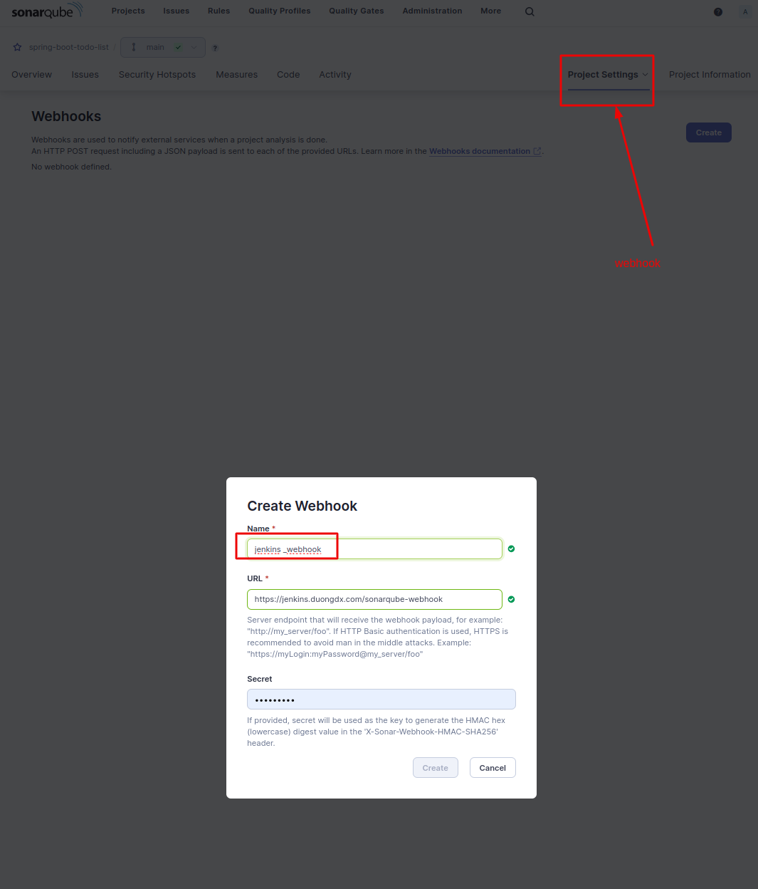

### . config `duongdx-kma/spring-boot-todo-list/jenkins.xml`
