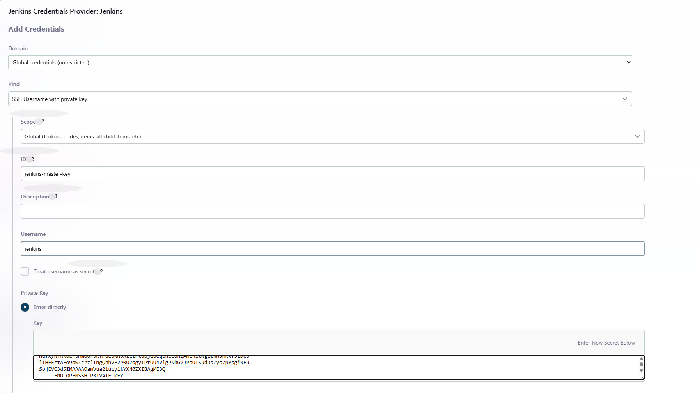
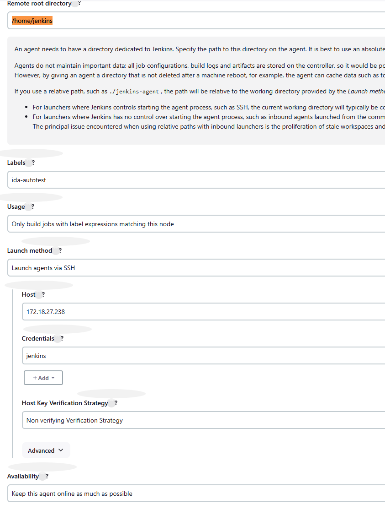
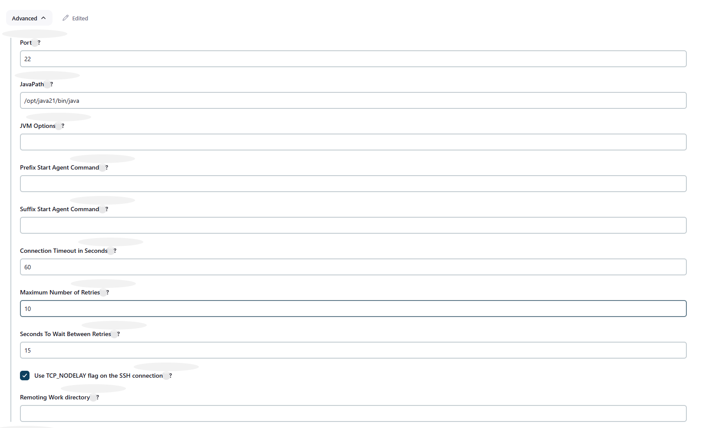

# Config jenkins slave/agent:


## I. `Jenkins-server` config:

### 1. create `Jenkins-server` ssh-key
```bash
ssh-keygen -t rsa -b 4096 -m PEM -f jenkins.pem -C "jenkins-master"
```


## II: `Jenkins-Agent` server config:

### 1. Create a Jenkins User 
```bash
sudo adduser jenkins --gecos "Jenkins Agent" --disabled-password
sudo usermod -aG sudo jenkins
```

### 2. install `java` and `openjdk21`:
```bash
cd /tmp

# download java open-jdk-21 binary
# wget https://download.java.net/openjdk/jdk21/ri/openjdk-21+35_linux-x64_bin.tar.gz
https://download.java.net/java/GA/jdk21.0.2/f2283984656d49d69e91c558476027ac/13/GPL/openjdk-21.0.2_linux-x64_bin.tar.gz

sudo mkdir -p /opt/java21
sudo tar xvf openjdk-21.0.2_linux-x64_bin.tar.gz -C /opt/java21 --strip-components=1

# Export JAVA_HOME
sudo tee -a /etc/profile > /dev/null <<EOF
# Java 21 Environment Variables
export JAVA_HOME=/opt/java21
export PATH=\$JAVA_HOME/bin:\$PATH
EOF

java -version
```

### 3. add ssh-public key into `jenkins user`: /home/jenkins/.ssh/authorized_keys
```bash
vim .ssh/authorized_keys
chmod 0600 /home/jenkins/.ssh/authorized_keys
```


## III. add Jenkins-Node on Jenkins Dashboard:

### 1. create Jenkins master credential: SSH Username with private key:



### 2. Add Jenkins-slave node: `Manage Jenkins > Nodes`



### 3. Advanced Config: update `Advanced > JavaPath`

Because i already install java-openjdk with custom way. Then we need overrida java path 


