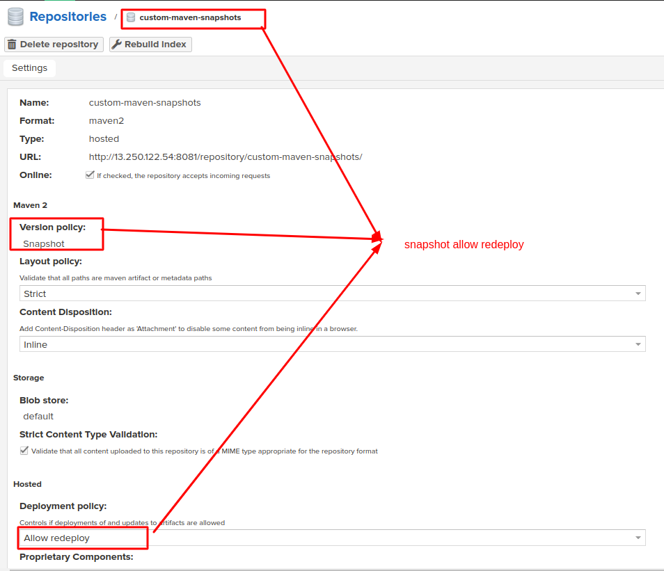
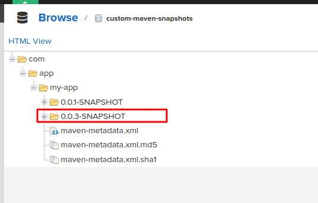

# Nexus Repository

## I. install Nexus Repository:

### 1. centos: `scripts/centos/install-nexus-repository.sh`

### 2. ubuntu: `scripts/ubuntu/install-nexus-repository.sh`

### 3. Amazon linux 2: `scripts/install-nexus-repository.sh`

## II. Nexus console

### 1. change admin password
### 2. Authentication: Login to Nexus
### 3. Authorization: Create `Role` and `Users` for pipeline

**step1: create role**


**step2: create local user**


### III. `Repository Type` in Nexus

### 1. Repo Type: `Hosted`


#### 1.1 `Releases` Repository (Type: `Hosted`)
```
Use Case: Stable Releases

Honestly, our code isn’t always ready for prime-time release. Nexus allows you to separate those releases which are ready to release and which are not. In these types of repositories, you push those builds that are well-tested and designated for further process.
```

### 1.2 `Snapshot` Repository (Type: `Hosted`)
```
Use Case: Continuous Integration and Testing

Snapshots are like works in progress. The snapshot repository in Nexus is where you store evolving versions of your project during development. This is particularly useful for continuous integration, enabling developers to access the latest, potentially unstable, builds for testing purposes.
```

### 1.3 `Hosted` Repository (Type: `Hosted`)
```
Use Case: Your Private Stash

Think of the hosted repository as your personal storage unit within Nexus. It’s where you keep your unique, in-house artifacts that aren’t meant for public consumption. Most of the time you are using Hosted Repositories either it is Snapshot or Release Type.
```

### 2. `Proxy` Repository


```
- A proxy repository is a repository that is linked to a remote repository.
- Any request for a component is verified against the local content of the proxy repository.
- If no local component is found, the request is forwarded to the remote repository. The component is then retrieved and stored locally in the repository manager, which acts as a cache.
Subsequent requests for the same component are then fulfilled from the local storage, therefore eliminating the network bandwidth and time overhead of retrieving the component from the remote repository again.

Ex: maven-central, npm, Docker, PyPI, yum
```

### 3. `Group` Repository:


## IV: Nexus Version policy:
```
Version Policy:
- Release - Artifacts are expected to be release versions (ie not changing)
- Snapshot - Artifacts are development releases, and are expected to be changing
- Mixed - Combination of Release and Snapshot
```

## V. Create `custom Maven2 Repository` in Nexus

### step-1: create maven2 `snapshot`


### step-2: create maven2 `release`


### step-3: create maven2 `proxy`
`

### step-4: create maven2 `group`


## VI. Apply to Java and maven:

### step-01: edit `~/.m2/settings.xml`

**make sure: `server->id` match `repository->id`**

```xml
<?xml version="1.0" encoding="UTF-8"?>
<settings xmlns="http://maven.apache.org/SETTINGS/1.0.0"
          xmlns:xsi="http://www.w3.org/2001/XMLSchema-instance"
          xsi:schemaLocation="http://maven.apache.org/SETTINGS/1.0.0 http://maven.apache.org/xsd/settings-1.0.0.xsd">
  <pluginGroups>
  </pluginGroups>
  <proxies>
  </proxies>

  <servers>
    <server>
        <id>maven-nexus-repo</id>
        <username>maven</username>
        <password>{7OWPr9JhJZ7u4u49GhC5XyzEpLP3zGkl9gqBlP9e}</password>
    </server>
  </servers>

  <mirrors>
    <mirror>
        <id>maven-nexus-repo</id>
        <mirrorOf>*</mirrorOf>
        <url>https://nexus.duongdx.com/repository/custom-maven-group/</url>
    </mirror>
  </mirrors>

  <profiles>
    <profile>
      <id>env-dev</id>
      <activation>
        <property>
          <name>target-env</name>
          <value>dev</value>
        </property>
      </activation>
      <!-- <properties>
        <tomcatPath>/path/to/tomcat/instance</tomcatPath>
      </properties> -->
    </profile>
	<profile>
     <id>snapshot</id>
     <repositories>
       <repository>
         <id>maven-nexus-repo</id>
         <name>custom-maven-snapshot</name>
         <url>https://nexus.duongdx.com/repository/custom-maven-group/</url>
         <!-- <url>https://nexus.duongdx.com/repository/custom-maven-snapshots/</url> -->
       </repository>
	   
     </repositories>
   </profile>
    <profile>
     <id>release</id>
     <repositories>
       <repository>
         <id>maven-nexus-repo</id>
         <name>custom-maven-snapshot</name>
         <url>https://nexus.duongdx.com/repository/custom-maven-group/</url>
         <!-- <url>https://nexus.duongdx.com/repository/custom-maven-release/</url> -->
       </repository>
     </repositories>
   </profile>
  </profiles>
</settings>
```

### step2: testing with maven:
```bash
mvn clean install

mvn test
```

### step-03: check repository: All package are cached on the `create-maven2-group: proxy` repository


### step-04: config `Maven` to publish `snapshot` - edit `pom.xml`

```xml
...
<version>0.0.1-SNAPSHOT</version>
...
<distributionManagement>
    <snapshotRepository>
        <id>nexus</id>
        <url>https://nexus.duongdx.com/repository/custom-maven-snapshots/</url>
    </snapshotRepository>
    <repository>
        <id>nexus</id>
        <url>https://nexus.duongdx.com/repository/custom-maven-releases/</url>
    </repository>
</distributionManagement>
```

### step-05: `Maven deploy` and check `SNAPSHOT`:

**command:**
```bash
mvn deploy
```

**check repo**


**change version: edit version in `pom.xml`**
```xml
<version>0.0.3-SNAPSHOT</version>
```


### step-06: `Maven deploy` and check `RELEASE`:

```xml
<version>0.0.3-RELEASE</version>
```

**command:**
```bash
mvn deploy
```

**check repo**


**check re-deploy: `ERROR` - because `RELEASE` is `immutable`**


### step-07: encrypt maven password

**step-07-01: create and encrypt maven `master-password`**
```powershell
# command: create master password
mvn --encrypt-master-password password12345

# result
{456789fhshdjfsdfsjhf/UgNNDZIe0Q=}


# create ~/.m2/settings-security.xml
<settingsSecurity>
    <master>{456789fhshdjfsdfsjhf/UgNNDZIe0Q=}</master>
</settingsSecurity>
```

**step-07-02: encrypt nexus `password`**
```powershell
# command: create master password
mvn --encrypt-password maven12345

# result
{7OWPr9JhJZ7u4u49GhC5XyzEpLP3zGkl9gqBlP9e}

# create ~/.m2/settings.xml
<settings>
    ...
    <servers>
        <server>
            <id>maven-nexus-repo</id>
            <username>maven</username>
            <password>{7OWPr9JhJZ7u4u49GhC5XyzEpLP3zGkl9gqBlP9e}</password>
        </server>
    </servers>
    ...
</settings>
```